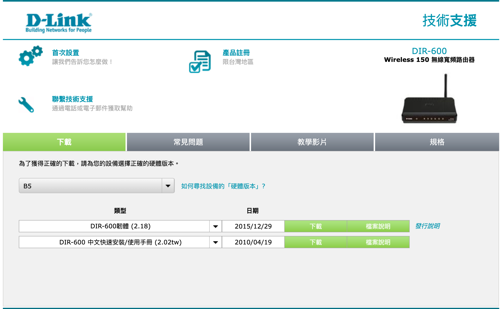
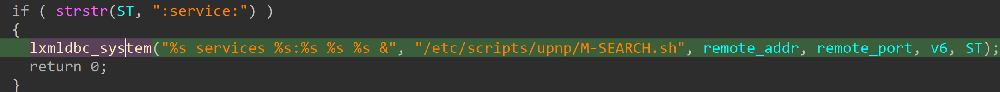
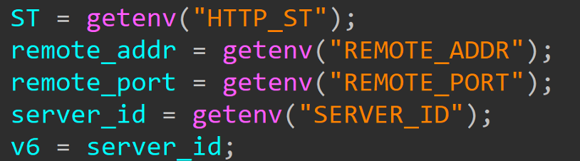

# D-link DIR-600 cmd injection vulnerability

## Overview

- Manufacturer's website information：https://www.dlink.com/
- Firmware download address ： [https://www.dlinktw.com.tw/techsupport/ProductInfo.aspx?m=DIR-600](https://www.dlinktw.com.tw/techsupport/ProductInfo.aspx?m=DIR-600)

## Affected version

Figure 1 shows the latest firmware of the router

## Vulnerability Details

The content obtained by the program through ST parameters is passed to lxmldbc_system(). There is a command injection vulnerability.

The vulnerability is in ssdp.cgi binary, the vulnerability that exists in the parsing of the HTTP request header field comes as input. 

Since there is no proper filter process in the user-supplied data before passing it to system(), an attacker can send malicious data and then parse it. This allows the attacker to perform a Pre-Authentication command injection.

## PoC
The Proof-of-Concept and video are in the attach.
