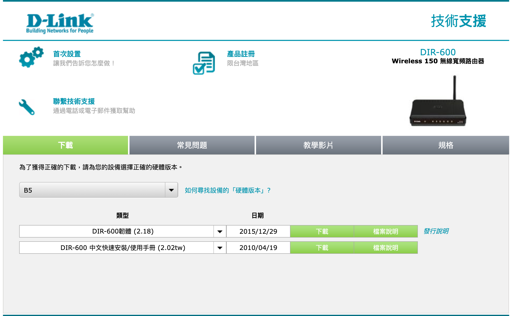
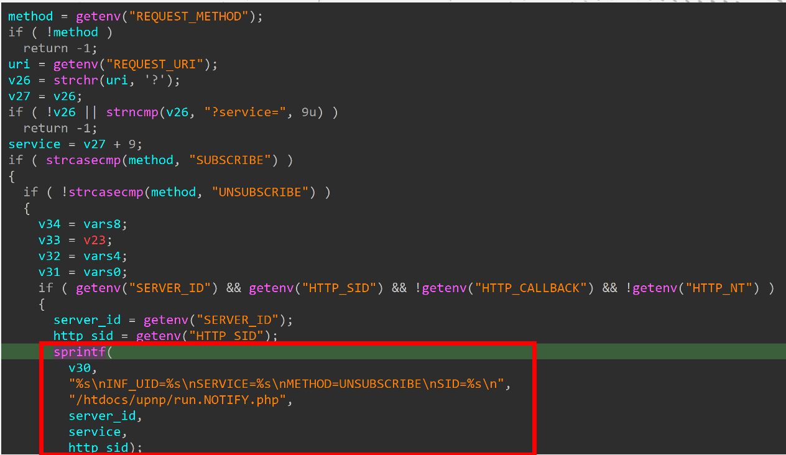
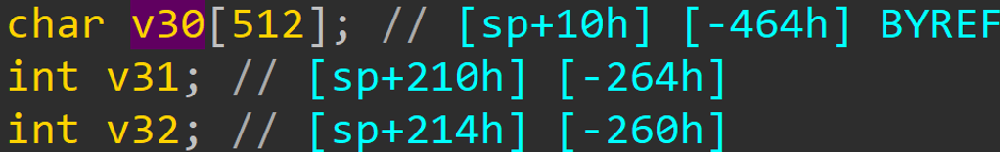

# D-link DIR-600 Stack overflow vulnerability

## Overview

- Manufacturer's website information：https://www.dlink.com/
- Firmware download address ： [https://www.dlinktw.com.tw/techsupport/ProductInfo.aspx?m=DIR-600](https://www.dlinktw.com.tw/techsupport/ProductInfo.aspx?m=DIR-600)

## Affected version

Figure 1 shows the latest firmware of the router

## Vulnerability Details

The content obtained by the program through service parameters is passed to v30, and then v30 only has 512 bytes space. There is a stack-based overflow vulnerability.

The vulnerability is in gena.cgi binary, the vulnerability that exists in the parsing of the HTTP request header with the query field comes as input. 

Since there is no proper validation process in the length of user-supplied data before copying it to a fixed-length stack-based buffer, an attacker can send more data to the local stack buffer and then parse it. This allows the attacker to perform a Pre-Authentication RCE.

## PoC
The Proof-of-Concept and video are in the attach.
