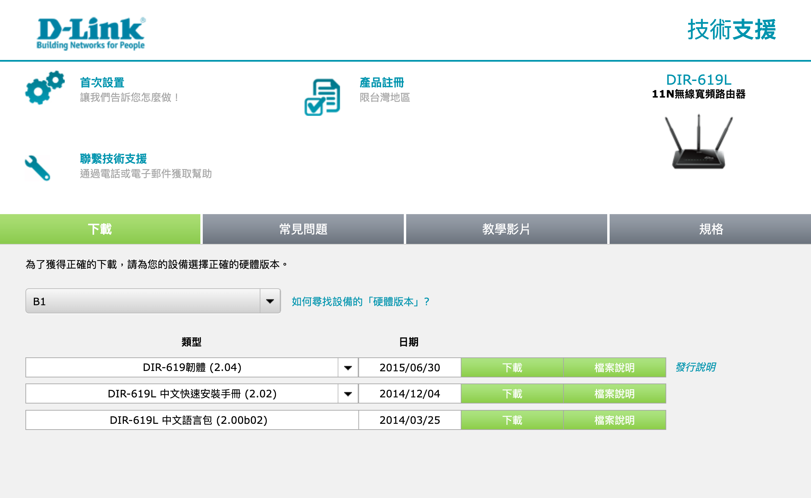
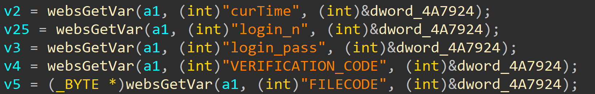
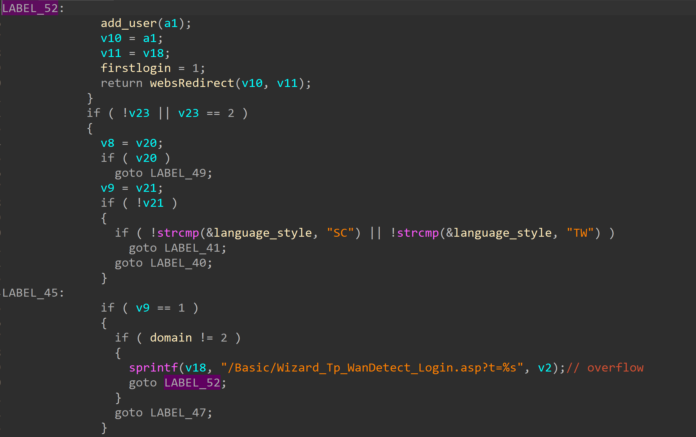
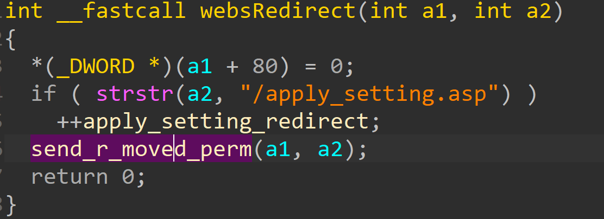
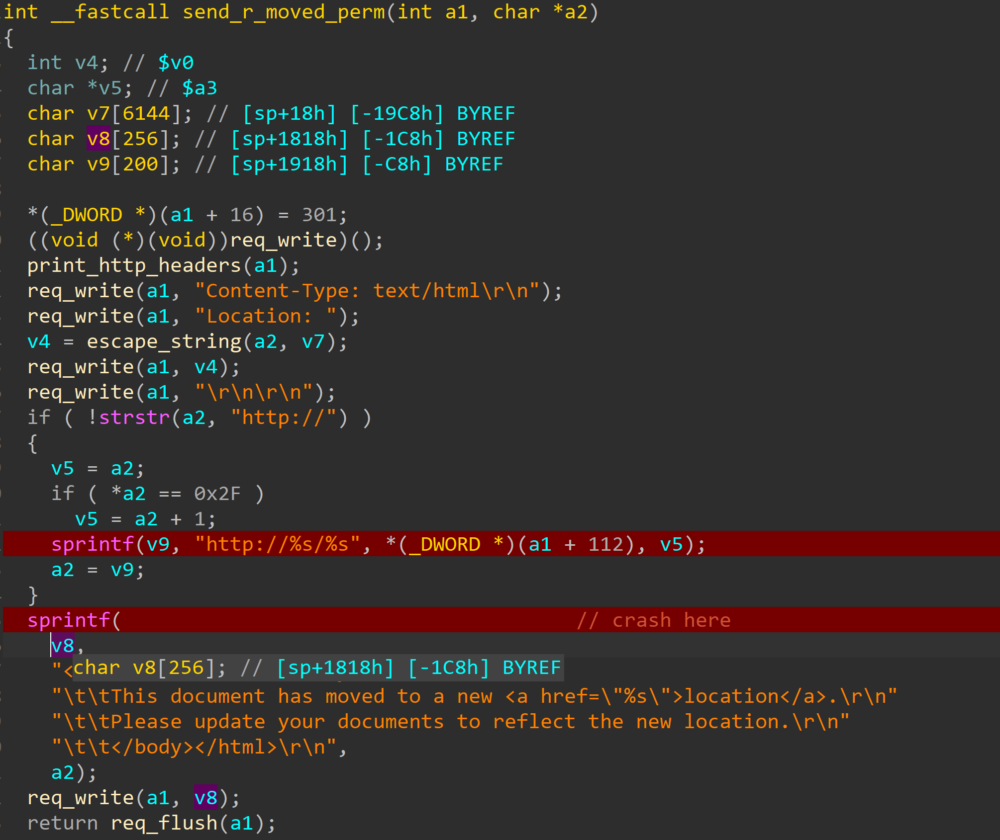
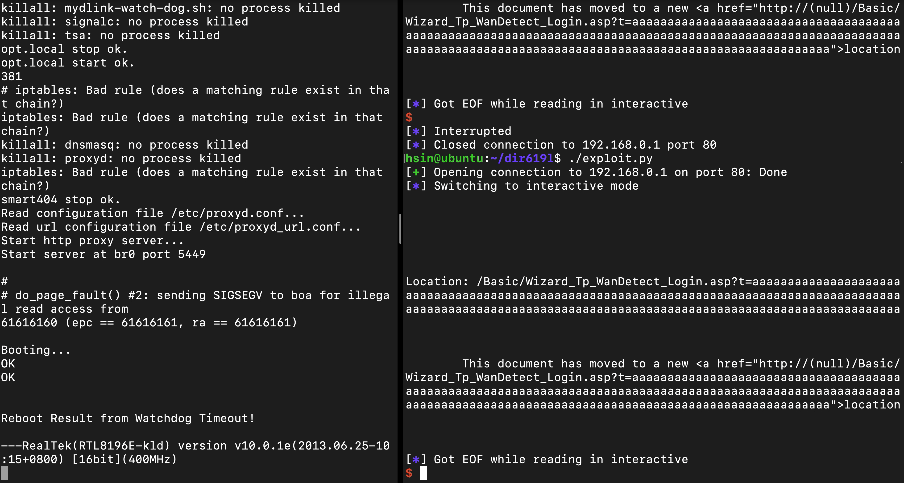

# D-link DIR-619L Stack overflow vulnerability

## Overview
- Vulnarable product: D-Link DIR-619L
- Manufacturer's website information：https://www.dlink.com/
- Firmware download address ： [https://www.dlinktw.com.tw/techsupport/ProductInfo.aspx?m=DIR-619L](https://www.dlinktw.com.tw/techsupport/ProductInfo.aspx?m=DIR-619L)

## Affected version
- Hardware version: B1
- Firmware version: 2.04

Figure 1 shows the latest firmware of the router

## Vulnerability Details
The vulnerability is in boa binary, the vulnerability that exists at /goform/formLogin via the curTime parameter.

The figure 2 shows webserver get the curTime parameter from http request.

And then the curTime pass into sprintf as a argument, which concat with '/Basic/Wizard_Tp_WanDetect_Login.asp?t=' and stored in v18.
And the program flow shows jumping to LABEL_52 to execute webRedirect function which the second argument is v18.

And the webRedirect call the send_r_moved_perm() which the second argument is v18.

In send_r_moved_perm function, the second parameter a2 which come from the v18 of formLogin(). Now it pass to the sprintf function as a argument, and concat with some html code,finally stored in v8, which just has 256 bytes of space.

When getting the curTime from http request, the program did not check the length, so it can be crafted by hacker, and then cause Denial of Service or Pre-auth arbitrary code execution. 

## PoC
The crafted http request can cause the router reboot.

